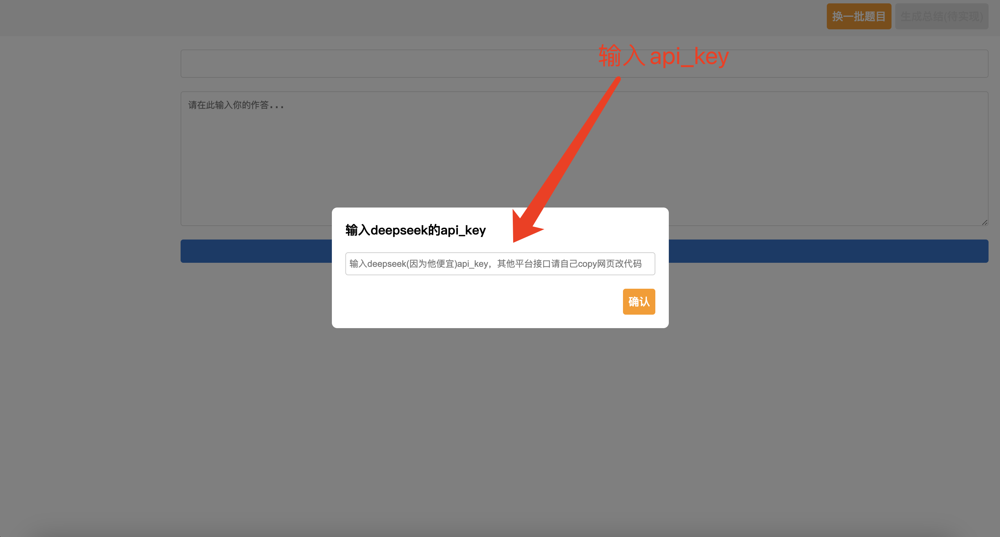
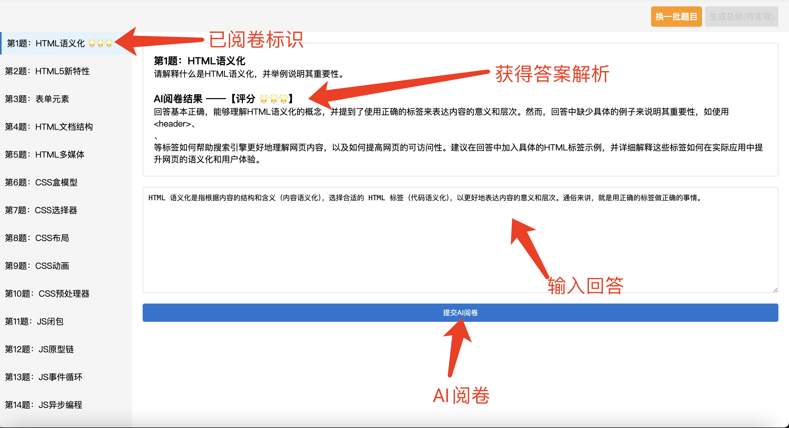
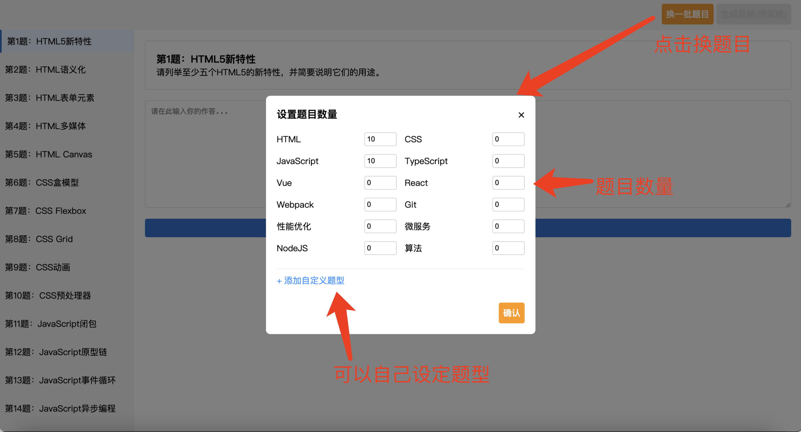

# 前端面试八股刷题
前端面试刷题，八股文，AI出题，AI阅卷，面试专用，大前端，deepseek。
极简配置，轻松上手。

# Demo在线使用
[链接在此🔗](https://practice.ainsure.top/)

# 本地部署
### 姿势一： 项目拉下来，然后双击项目中的index.html文件（用浏览器打开）
适用于直接使用人群

### 姿势二（）： 用编辑器打开，live server启动
适用于需要修改内容or 配置人群

# 如何使用
### 1、输入你的deepseek api_key
api_key只存储在localstorage里面用于调取模型，其他平台可以自己修改改代码中相关配置。

### 2、输入api_key后直接拉取题目开始答题

### 3、换一批题目

*ok，简单好用～
注：本代码由cursor生成 + 本人流程调试，自测确认整体流程完备，如有兼容性 or 其他使用问题，欢迎提issue～*